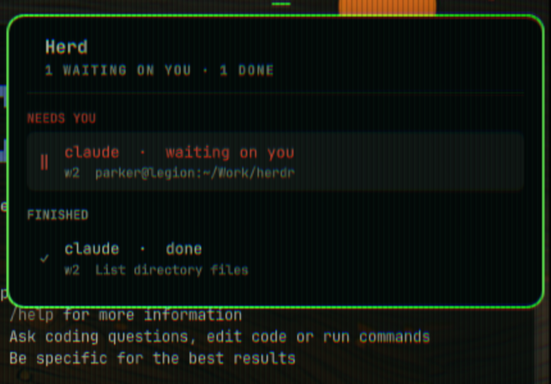
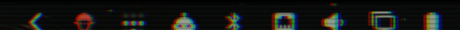

# Herd

**Which coding agent needs you, on the Omarchy bar.**

[herdr](https://herdr.dev) already knows which of your agents is blocked. Your
desktop does not. Herd is one bar icon and one tray: the icon goes urgent the
moment anything is waiting on you, and the tray says who.

```
Herd
1 waiting on you · 2 working

NEEDS YOU
  ‖  claude · waiting on you
     w2  refactor the detection manifests

RUNNING
  ▶  codex · working
     w1  addev decision record
  ▶  claude · working
     w3  omarchy-herd
```

Every agent is a row you can act on. Click one and you land in that pane, with
the terminal window raised. Right-click the bar icon to go straight to whatever
is waiting, without opening the tray at all. The whole thing leaves the bar when
herdr is not running.





## What it is not

Omarchy already ships `omarchy.agents`, which is about **spend** — rate limits,
token meters, pace. Herd is about **attention**. They sit next to each other and
answer different questions.

## How it works

Two halves, one file, no daemon.

```
herdr server
    │  [[events]] pane.agent_status_changed
    ▼
herd-sync.sh  ──writes──▶  ~/.local/state/omarchy/herd/herd.json
                                      │  FileView
                                      ▼
                            Panel.qml     (pure display)
```

The herdr half subscribes to herdr's own events and writes a small JSON file.
The Omarchy half draws whatever appears in that file — the same shape
`omarchy.agents` uses to display the records `omarchy-agent-usage-update`
writes. Neither half imports the other, and either one runs fine with the other
missing.

Content updates are event-driven, so the icon changes the instant an agent
does. One thing is polled: whether herdr is alive at all. herdr removes its
socket when the server stops, so a three-second `test -S` on that path is a
truthful liveness check — and no event can report it, because the server that
would have sent one is the thing that went away.

## Install

Both halves, from this one repository.

```bash
omarchy plugin add https://github.com/parker-brown-family/omarchy-herd.git --enable
```
```bash
herdr plugin install parker-brown-family/omarchy-herd/herdr
```
```bash
omarchy bar move brownfamilysports.herd --section right
```

Restart or reattach herdr once so the plugin's startup hook runs and publishes
the first snapshot.

## Settings

In the Omarchy bar widget settings:

| Setting | Default | What it does |
| --- | --- | --- |
| Hide when no agents are running | on | Leave the bar entirely rather than showing an empty icon |
| herdr socket path | *(session default)* | Point at a named session. `herdr session list` prints the path |

To have the terminal **window** raised when you click through to a pane — not
just the pane focused inside a server nobody is looking at — set your terminal's
Hyprland class:

```bash
herdr plugin config-dir brownfamilysports.herd
```

Put `TERMINAL_CLASS=<your terminal's class>` in `config.env` in that directory.
`hyprctl clients` will tell you the class.

## States

Badges match Terminal Delight's agent wall, so the two read alike.

The tray groups agents by what they want from you, and a group with nothing in
it is not drawn at all.

| Section | herdr state | Meaning |
| --- | --- | --- |
| NEEDS YOU | `blocked` | Waiting on you — a permission prompt or a question |
| RUNNING | `working` | A turn is running |
| FINISHED | `done` | Finished, and you have not looked yet |
| IDLE | `idle` | At rest, wanting nothing |

Each row spells its state out rather than leaving it to the badge, because
"waiting on you" is the point and a glyph makes you translate it first.

herdr has no error state; it folds rate limits and API failures into `unknown`.
Herd does not invent one — unknown agents rest with idle.

## Notifications

One notification when an agent enters `blocked`, and nothing else. herdr emits
that event on transition, so it fires once per block rather than once per
spinner frame. `done` stays silent on purpose: the tray already shows it, and a
notification for every finished turn is noise.

## What it runs

A herdr plugin is ordinary code running as you, so here is all of it:

- `herdr/herd-sync.sh` runs when herdr reports an agent event. It calls
  `herdr agent list`, writes the result to
  `~/.local/state/omarchy/herd/herd.json`, and calls `notify-send` when an
  agent becomes blocked.
- `herdr/herd-focus.sh` runs when you click. It calls `herdr agent focus`, and
  `hyprctl dispatch` if you set `TERMINAL_CLASS`.
- `Panel.qml` reads that one JSON file and runs `test -S` on herdr's socket
  every three seconds to see whether herdr is still alive.

Nothing else. No network, no telemetry, no daemon, and nothing written outside
that one state directory and the config file you create yourself. `config.env`
is parsed rather than sourced, so a stray line in it cannot become code.

## Uninstall

```bash
herdr plugin uninstall brownfamilysports.herd
```
```bash
omarchy plugin remove brownfamilysports.herd
```
```bash
rm -rf ~/.local/state/omarchy/herd
```

## Troubleshooting

**The icon is not on the bar.** It hides itself when herdr is not running —
that is the intended behaviour, and `herdr session list` will tell you. If
herdr is running, check that the widget is in your bar layout with
`omarchy plugin list`, and that the socket path matches
`herdr session list` if you use a named session.

**The icon is there but the tray is empty.** The herdr half is probably not
installed, or has not run yet. `herdr plugin list` should show
`brownfamilysports.herd`, and `herdr plugin log list --plugin
brownfamilysports.herd` shows whether its hooks are firing. The startup hook
only runs when a herdr server starts, so reattach once after installing.

**Clicking a row focuses the pane but does not raise the window.** Set
`TERMINAL_CLASS` (see Settings). On Hyprland 0.56 and newer the old
`hyprctl dispatch focuswindow` form no longer works; the plugin uses the Lua
dispatcher and falls back, so this should just work — but a class that does not
match any window is a silent no-op either way. `hyprctl clients` lists them.

## Development

```bash
sh tests/run.sh
```

61 checks, no framework, and no herdr server or desktop session required —
everything runs against stubs in `tests/stubs`. The parts that genuinely need a
live herdr are the parts a test cannot honestly cover, and the suite does not
pretend otherwise. CI additionally runs `shellcheck`, checks every script parses
as POSIX `sh`, and deliberately breaks the pane-id validation to confirm the
tests notice.

## Requirements

Linux, Hyprland, `omarchy-shell`, herdr 0.7.5 or newer, and `jq`.

herdr 0.7.5 is a real floor rather than a guess: `[[startup]]` hooks arrived in
that release, and without one the tray stays empty after a restart until an
agent happens to change state.

## License

MIT.
